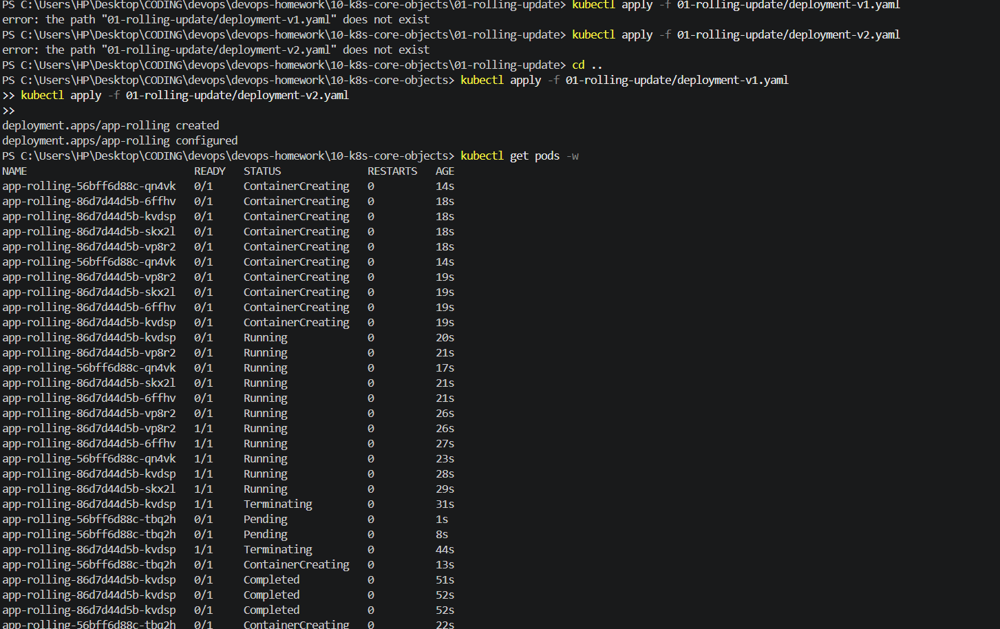
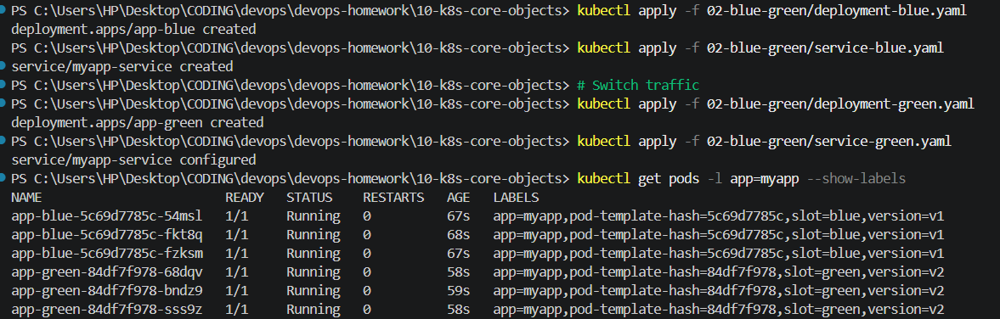
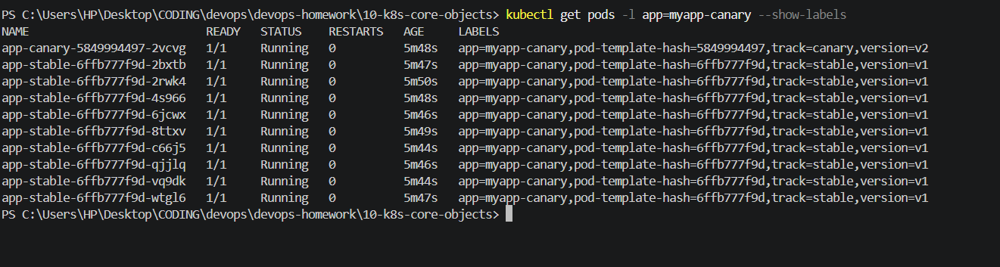
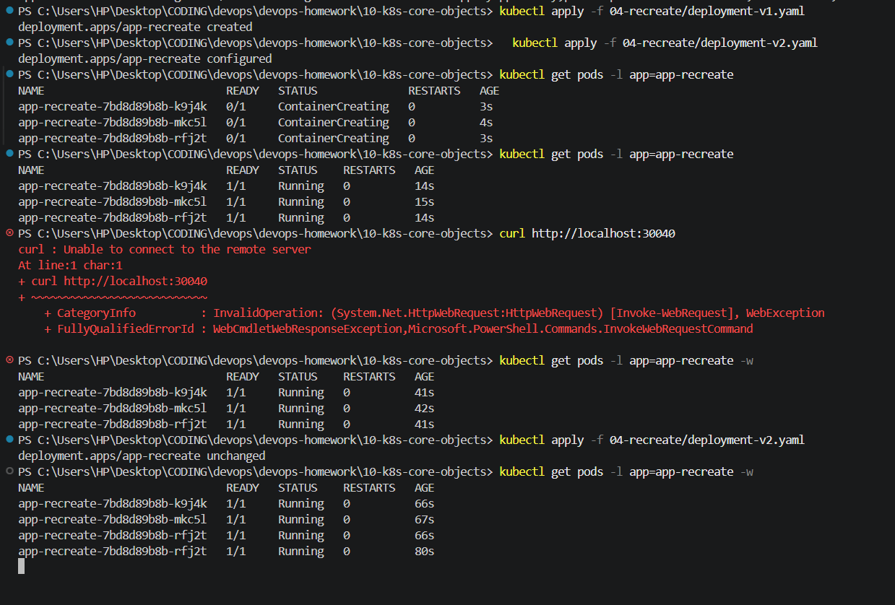

# Kubernetes Homework - Session 10: Pods, ReplicaSets & Deployments

## Task 1: Deployment Strategies

### 01. Rolling Update
**Description:** A deployment strategy that slowly replaces old Pods with new ones, ensuring there is no downtime.
- **Commands:**
  ```bash
  kubectl apply -f 01-rolling-update/deployment-v1.yaml
  kubectl apply -f 01-rolling-update/deployment-v2.yaml
  ```
- **Output & Screenshot:**
  
- **Explanation:** The old version Pods are terminated one by one as the new version Pods become ready.

### 02. Blue-Green Deployment
**Description:** Two identical environments (Blue and Green). Traffic is switched from Blue (old) to Green (new) via Service selector update.
- **Commands:**
  ```bash
  kubectl apply -f 02-blue-green/deployment-blue.yaml
  kubectl apply -f 02-blue-green/service-blue.yaml
  # Switch traffic
  kubectl apply -f 02-blue-green/deployment-green.yaml
  kubectl apply -f 02-blue-green/service-green.yaml
  ```
- **Output & Screenshot:**
  
- **Explanation:** The transition is instantaneous because it involves updating the Service's label selector to point to the Green deployment.

### 03. Canary Deployment
**Description:** A small subset of traffic is routed to a new version (Canary) while the majority stays on the stable version.
- **Commands:**
  ```bash
  kubectl apply -f 03-canary/deployment-stable.yaml
  kubectl apply -f 03-canary/deployment-canary.yaml
  kubectl apply -f 03-canary/service.yaml
  ```
- **Output & Screenshot:**
  
- **Explanation:** The Service routes traffic to both Deployments because they share the same label. The ratio depends on the number of Pod replicas in each deployment.

### 04. Recreate Deployment
**Description:** All old Pods are terminated before new Pods are created, resulting in downtime but ensuring no two versions run simultaneously.
- **Commands:**
  ```bash
  kubectl apply -f 04-recreate/deployment-v1.yaml
  kubectl apply -f 04-recreate/deployment-v2.yaml
  ```
- **Output & Screenshot:**
  
- **Explanation:** The `strategy: type: Recreate` ensures that the old pods are completely deleted before starting the new version's pods.

---

## Task 2: Pod Lifecycle

### 01. Running
- **Command:** `kubectl apply -f pod-lifecycle/01-running.yaml`
- **Check Details:** `kubectl get pod running-pod && kubectl describe pod running-pod`

- **Explanation:** The normal state of a Pod where the container has started successfully and is running as expected.

### 02. Pending
- **Command:** `kubectl apply -f pod-lifecycle/02-pending.yaml`
- **Check Details:** `kubectl get pod pending-pod && kubectl describe pod pending-pod`

- **Explanation:** The Pod stays in `Pending` because it cannot be scheduled on a node (often due to requesting more CPU/Memory resources than available in the cluster).

### 03. Succeeded
- **Command:** `kubectl apply -f pod-lifecycle/03-succeeded.yaml`
- **Check Details:** `kubectl get pod succeeded-pod && kubectl describe pod succeeded-pod`
- **Output & Screenshot:**
  > *(Insert Screenshot)*
- **Explanation:** The Pod runs a task that completes successfully (exit code 0), and because its `restartPolicy` is set to `Never` or `OnFailure`, it enters the `Completed/Succeeded` state without restarting.

### 04. Failed
- **Command:** `kubectl apply -f pod-lifecycle/04-failed.yaml`
- **Check Details:** `kubectl get pod failed-pod && kubectl describe pod failed-pod`
- **Output & Screenshot:**
  > *(Insert Screenshot)*
- **Explanation:** The container exits with a non-zero exit code (error) and is not configured to restart, so the Pod's phase becomes `Failed`.

### 05. CrashLoopBackOff
- **Command:** `kubectl apply -f pod-lifecycle/05-crashloopbackoff.yaml`
- **Check Details:** `kubectl get pod crashloop-pod && kubectl describe pod crashloop-pod`
- **Output & Screenshot:**
  > *(Insert Screenshot)*
- **Explanation:** The container repeatedly crashes after starting. Kubernetes tries to restart it, but backing off the restart delay each time, leading to `CrashLoopBackOff`.

### 06. ImagePullBackOff
- **Command:** `kubectl apply -f pod-lifecycle/06-imagepullbackoff.yaml`
- **Check Details:** `kubectl get pod imagepull-pod && kubectl describe pod imagepull-pod`
- **Output & Screenshot:**
  > *(Insert Screenshot)*
- **Explanation:** The node's container runtime cannot pull the requested image (e.g., wrong image name, tag, or authentication issue). Kubernetes retries pulling with an increasing delay.

### 07. Readiness Probe
- **Command:** `kubectl apply -f pod-lifecycle/07-readiness.yaml`
- **Check Details:** `kubectl get pod readiness-pod && kubectl describe pod readiness-pod`
- **Output & Screenshot:**
  > *(Insert Screenshot)*
- **Explanation:** The Pod starts, but it does not receive traffic from a Service until the readiness probe passes. We observe it is `Running` but `Ready: 0/1` until the probe succeeds.

### 08. Liveness Probe
- **Command:** `kubectl apply -f pod-lifecycle/08-liveness.yaml`
- **Check Details:** `kubectl get pod liveness-pod && kubectl describe pod liveness-pod`
- **Output & Screenshot:**
  > *(Insert Screenshot)*
- **Explanation:** The liveness probe periodically checks if the container is healthy. If the probe fails continuously, Kubernetes kills the container and restarts it according to the restart policy.

### 09. Startup Probe
- **Command:** `kubectl apply -f pod-lifecycle/09-startup.yaml`
- **Check Details:** `kubectl get pod startup-pod && kubectl describe pod startup-pod`
- **Output & Screenshot:**
  > *(Insert Screenshot)*
- **Explanation:** Used for slow-starting applications. Liveness and readiness probes are disabled until the startup probe succeeds, preventing Kubernetes from prematurely killing the application.

### 10. Init Container
- **Command:** `kubectl apply -f pod-lifecycle/10-init-container.yaml`
- **Check Details:** `kubectl get pod init-pod && kubectl describe pod init-pod`
- **Output & Screenshot:**
  > *(Insert Screenshot)*
- **Explanation:** The init container runs to completion before the main application container starts. If the init container fails, the main container will not start.

### 11. Multi-container Pod
- **Command:** `kubectl apply -f pod-lifecycle/11-multi-container.yaml`
- **Check Details:** `kubectl get pod multi-pod && kubectl describe pod multi-pod`
- **Output & Screenshot:**
  > *(Insert Screenshot)*
- **Explanation:** The Pod runs two or more containers simultaneously (e.g., an app container and a sidecar container). The `READY` column will show `2/2` when both are ready.

### 12. Graceful Termination
- **Command:** `kubectl apply -f pod-lifecycle/12-termination.yaml`
- **Check Details:** `kubectl delete pod termination-pod` (while watching pods in another terminal)
- **Output & Screenshot:**
  > *(Insert Screenshot)*
- **Explanation:** When the Pod is deleted, Kubernetes sends a SIGTERM signal to the container and waits for the `terminationGracePeriodSeconds` before forcibly killing it.