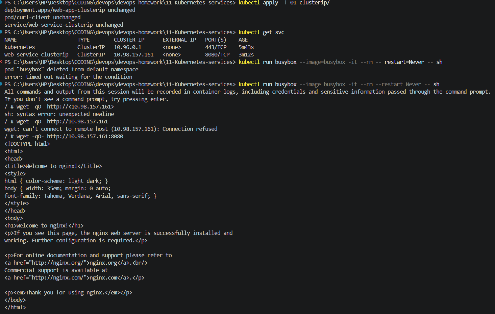
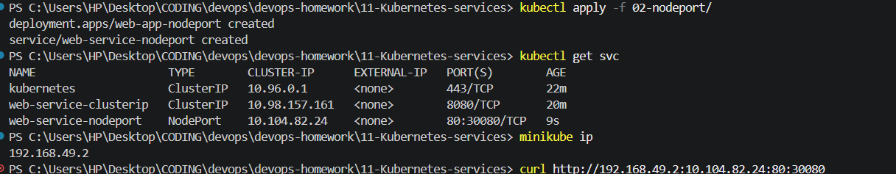
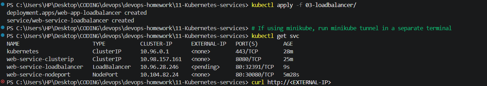

# Kubernetes Homework - Session 11: Networking & Services

## Task 1: Kubernetes Services

### 1. ClusterIP
**Description:** The default Service type. Exposes the Service on an internal IP in the cluster. This makes the Service only reachable from within the cluster.
- **Commands:**
  ```bash
  kubectl apply -f 01-clusterip/
  ```
- **Check Details:** `kubectl get svc`
- **Test Connectivity:** (From a temporary pod inside the cluster)
  ```bash
  kubectl run busybox --image=busybox -it --rm -- restart=Never -- sh
  wget -qO- http://<CLUSTER-IP>
  ```
- **Output & Screenshot:**
  

### 2. NodePort
**Description:** Exposes the Service on each Node's IP at a static port (NodePort). A ClusterIP Service, to which the NodePort Service routes, is automatically created.
- **Commands:**
  ```bash
  kubectl apply -f 02-nodeport/
  ```
- **Check Details:** `kubectl get svc`
- **Test Connectivity:** 
  ```bash
  minikube ip
  curl http://<MINIKUBE-IP>:<NODE-PORT>
  ```
- **Output & Screenshot:**
  

### 3. LoadBalancer
**Description:** Exposes the Service externally using a cloud provider's load balancer. NodePort and ClusterIP Services, to which the external load balancer routes, are automatically created.
- **Commands:**
  ```bash
  kubectl apply -f 03-loadbalancer/
  # If using minikube, run minikube tunnel in a separate terminal
  ```
- **Check Details:** `kubectl get svc`
- **Test Connectivity:** 
  ```bash
  curl http://<EXTERNAL-IP>
  ```
- **Output & Screenshot:**
  

### 4. ExternalName
**Description:** Maps the Service to the contents of the `externalName` field (e.g. `foo.bar.example.com`), by returning a CNAME record with its value.
- **Commands:**
  ```bash
  kubectl apply -f 04-externalname/
  ```
- **Check Details:** `kubectl get svc`
- **Test Connectivity:** 
  ```bash
  kubectl run busybox --image=busybox -it --rm -- restart=Never -- sh
  nslookup <external-name-service-name>
  ```
- **Output & Screenshot:**
  > *(Insert Screenshot here)*

### 5. Headless Service
**Description:** A Service with `clusterIP: None`. It does not load balance or proxy traffic. Instead, DNS returns the IP addresses of the associated Pods directly.
- **Commands:**
  ```bash
  kubectl apply -f 05-headless/
  ```
- **Check Details:** `kubectl get svc`
- **Test Connectivity:** 
  ```bash
  kubectl run busybox --image=busybox -it --rm -- restart=Never -- sh
  nslookup <headless-service-name>
  ```
- **Output & Screenshot:**
  > *(Insert Screenshot here)*

---

## Task 2: Kubernetes Object Comparison

### Deployment vs ReplicaSet
- **Purpose:** 
  - **ReplicaSet** ensures a specified number of pod replicas are running at any given time.
  - **Deployment** is a higher-level concept that manages ReplicaSets and provides declarative updates to Pods.
- **Pod Management:** ReplicaSet directly manages Pods based on labels. Deployment manages ReplicaSets, which in turn manage Pods.
- **Scaling:** Both can be scaled up or down, but typically you scale the Deployment, which updates the ReplicaSet.
- **Rolling Updates:** Deployments support rolling updates and rollbacks. ReplicaSets do not natively support rolling updates; you have to create a new ReplicaSet and scale the old one down manually.
- **Relationship:** A Deployment creates and manages ReplicaSets. You should almost never manage a ReplicaSet directly; always use a Deployment.

### Deployment vs DaemonSet vs StatefulSet
| Feature | Deployment | DaemonSet | StatefulSet |
| :--- | :--- | :--- | :--- |
| **Use Cases** | Stateless applications (web servers, APIs). | Node-specific tasks (log collectors, monitoring agents). | Stateful applications (databases, key-value stores). |
| **Pod Creation** | Randomly placed across nodes by the scheduler. | Exactly one Pod per eligible Node. | Created sequentially with sticky, unique identities. |
| **Scaling** | Replicas can be scaled up/down anywhere. | Scales automatically with the number of Nodes. | Replicas scale sequentially (0, 1, 2...). |
| **Networking** | Pod IPs change. Traffic is load-balanced via Service. | Pod uses Node IP or its own IP; usually communicates locally. | Pods have a stable, unique DNS name (Headless Service). |
| **Storage** | PVCs are shared (usually) or volatile. | HostPath or node-local storage. | PVCs are unique per Pod and persistent across rescheduling. |

### ReplicaSet vs Service
- **ReplicaSet Responsibility:** Ensures the correct number of Pods are running. It handles compute resources and application lifecycle.
- **Service Responsibility:** Ensures network accessibility to those Pods. It acts as an internal load balancer and provides a stable IP/DNS.
- **Why a Service is required:** Pods are ephemeral; they can be destroyed and recreated with new IP addresses. A Service provides a static entry point to access the dynamically changing Pod IPs.
- **How traffic reaches Pods:** Traffic hits the Service's IP/Port. The Service uses `kube-proxy` rules to distribute traffic to the Pod IPs matching its label selector.