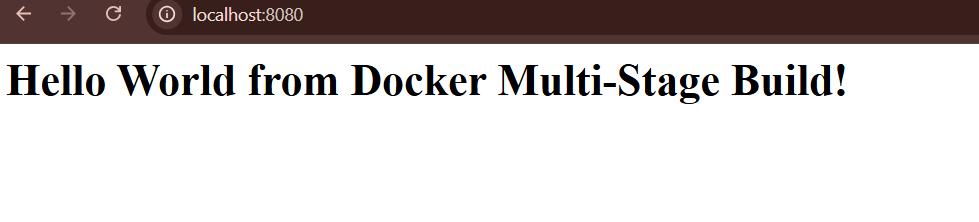

# Docker Multi-Stage Build Homework

## Student Information

**Name:** YOUR NAME

**Enrollment Number:** YOUR ENROLLMENT NUMBER

---

## Task 1: Multi-Stage Docker Build

### Build Command

```bash
docker build -t multi-stage-app .
```

### Run Command

```bash
docker run -d -p 8080:3000 --name multi-stage-container multi-stage-app
```

### Application URL

http://localhost:8080

### Output

The application displays:

> Hello World from Docker multi-stage build

### Screenshot 1




### Docker Container Verification

```bash
docker ps
```

The container is running and port **8080** is mapped.

### Screenshot 2


---

## Task 3: Docker Application Deployment

### Node.js Application

Successfully built and ran using Docker.

### Python Application

Successfully built and ran using Docker.

### Java Application

Successfully built and ran using Docker.

